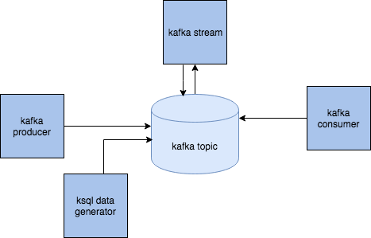
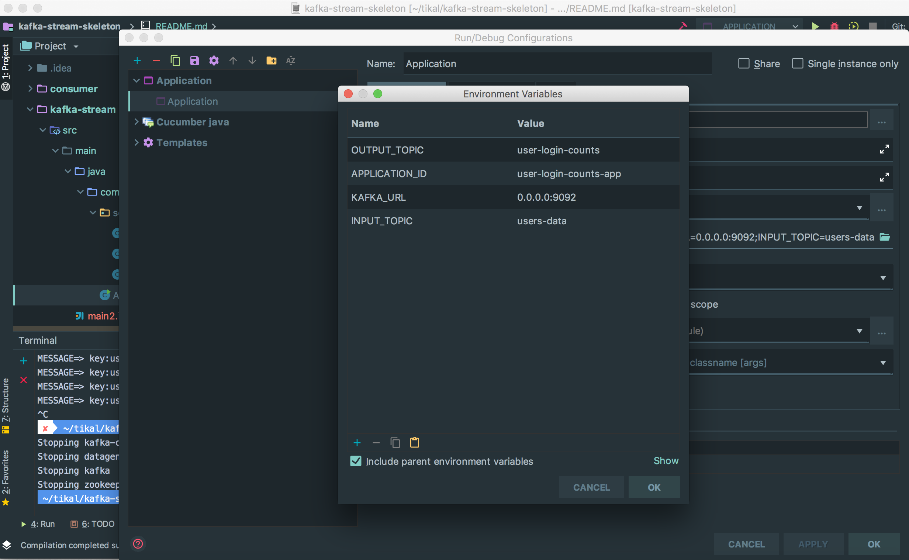

# kafka-stream-skeleton
<p>Kafka stream starter project</p>
<ul>
  <li><a href="#Overview">Overview</a></li>
  <li><a href="#Mock-data">Mock data</a></li>
  <li><a href="#Stream-processing">Stream processing</a></li>
  <li><a href="#Consuming-stream-data">Consuming stream data</a></li>
  <li><a href="#Installation">Installation</a></li>
  <li><a href="#project-planning-guidelines">Project Planning Guidelines</a></li>
  <li><a href="#kafka-elasticsearch-connect">Kafka Elasticsearch connect</a></li>
</ul>

## Overview

This skeleton contains stream processor and consumer that just print out the stream output.
There is a module contains the data model used by the streaming application.
In order to fill the stream input topic with data, you can use data generation tool, or build the producer image.



## Mock data

1. By data generation
Confluent has great [tool](https://docs.confluent.io/current/ksql/docs/tutorials/generate-custom-test-data.html) to generate data by avro schema.

Check also [GitHub page](https://github.com/confluentinc/ksql/tree/master/ksql-examples)

The schema must be located in <root_directory>/schema.

The current schema is model.avro that has same types as the model used for stream processing.

The schema is used in docker-compose file, in image `datagen`

```yaml
  datagen:
    image: confluentinc/ksql-examples:latest
    container_name: datagen
    volumes:
    - ./schema:/schema
    command: "bash -c 'ksql-datagen \
                      schema=./schema/model.avro \
                      key=userName \
                          format=json \
                          topic=users-data \
                          maxInterval=1000 \
                          bootstrap-server=kafka:9092 \
                          propertiesFile=./schema/datagen.properties'"
```

If you wish to change the schema name, just change the value of the `schema` attribute, in the bash command section.

You may need also to change the key attribute and set it to one of the columns in your new schema.

The avro schema can be a very powerful tool, check more examples [here](https://github.com/confluentinc/ksql/tree/master/ksql-examples/src/main/resources)  
 
2. By custom producer

data can be also produced  by using KafkaProducer class. see the project module producer.

you need to specify the key and value serializations, there are defaults for primitives like String, int, long, byte array, for json we need to write our own class. 

```java
configProperties.put(ProducerConfig.KEY_SERIALIZER_CLASS_CONFIG, "org.apache.kafka.common.serialization.StringSerializer");
configProperties.put(ProducerConfig.VALUE_SERIALIZER_CLASS_CONFIG, "com.kafka_stream_skeleton.producer.serialization.JsonPOJOSerializer");
KafkaConsumer<String, Long> consumer = new KafkaConsumer<>(props);
```
If using this option, you need to uncomment producer image in the docker-compose file, and comment the datagen image

3. you can also run some kafka connect tool to some external source.
 
There is no example here. need to add your own docker image for it, or run it locally

## Stream processing

First, I recommend to check [confluent stream code example](https://github.com/confluentinc/kafka-streams-examples/tree/5.0.1-post/src/main/java/io/confluent/examples/streams).

Here in this project, Stream processing is done in the stream module's Application class. The stream reads the input topic data, and does some grouping and aggregation.
The stream must define SerDes (Serialization and Deserialization) for the key  and value. SerDes also need to be defined if grouping/counting/aggregation methods change the key/value type.

```java
Serde<LoginData> loginDataSerde = SerdeBuilder.buildSerde(LoginData.class);

final KStream<String, LoginData> source = builder.stream(INPUT_TOPIC, 
                                           Consumed.with(Serdes.String(), loginDataSerde));

```

and because the counting method change the types, SerDes must be specified in the `to` command:
```java

final Serde<String> stringSerde = Serdes.String();

Serde<LoginCount> loginCountSerde = SerdeBuilder.buildSerde(LoginCount.class);

counts.toStream().map((windowed,count)->new KeyValue<>(windowed.key(),new LoginCount(windowed.key(),count,windowed.window().start(),windowed.window().end())))
                .to(OUTPUT_TOPIC, Produced.with(stringSerde, loginCountSerde));
```

There are default SerDes for primitive types provided by Kafka Streams API. For JSON, one needs to write her own SerDes.
You can use the class`com.kafka_stream_skeleton.serialization.SerdeBuilder`, to create a JSON SerDes based on your model.

## Consuming stream data

Stream output data is written to an output topic. If you wish to consume and display the topic's content, there is a consumer example in this project, that just print result to the console.
Also here, one needs to specify correctly the deserializers, according to the stream results:

```java
props.put("key.deserializer", StringDeserializer.class.getName());
props.put("value.deserializer", "com.kafka_stream_skeleton.consumer.serialization.JsonPOJODeserializer");

KafkaConsumer<String, LoginCount> consumer = new KafkaConsumer<>(props);
    
consumer.subscribe(Arrays.asList(TOPIC));
```

to see output:
```
docker logs kafka-consumer -f
```

You can use Kafka Connect to send the results to an external system, such as SQL DB or elasticsearch.

## Installation

### prerequisite

1. docker
2. git
3. maven
4. jdk8 

### install 

If you wish to make changes to this repository, don't forget to fork this before cloning.

1. Run `mvn clean install`
2. You **MUST** add .env file contains **your IP**, for example:
```properties
LOCALHOST_IP=192.168.2.100
```
NOTE: if you change network, you may change this value according to your current IP.

3. `docker-compose up -d --build`

To make sure everything works well, run `docker ps`. You should see 4 containers running:

    1. kafka
    2. zookeeper
    3. kafka-stream
    4. kafka-consumer
    
4. To produce data into the input topic:

     4.1 Uncomment in `docker-compose.yml` file the service you want work with (datagen or producer)
     
     4.2 Run the container using `docker-compose up -d --build datagen` or `docker-compose up -d --build kafka-producer`
     
     4.3 If you wish to stop producing data, you can stop the containers using `docker-compose stop datagen` or `docker-compose stop producer`

5. Check if the consumer shows the stream output successfully:
  run `docker logs kafka-consumer -f` or `docker-compose logs -f consumer`.
  You should see output similar to this:

```
MESSAGE=> key:user_4, value:LoginCount{userName='user_4', count=1, windowStart=1545346143000, windowEnd=1545346144000}
MESSAGE=> key:user_2, value:LoginCount{userName='user_2', count=1, windowStart=1545346144000, windowEnd=1545346145000}
MESSAGE=> key:user_3, value:LoginCount{userName='user_3', count=1, windowStart=1545346144000, windowEnd=1545346145000}
MESSAGE=> key:user_4, value:LoginCount{userName='user_4', count=1, windowStart=1545346145000, windowEnd=1545346146000}
```  

6. To open kafka bash run `docker exec -i -t kafka /bin/bash`

Here, you can run Kafka tools from CLI, for example creating a topic

`kafka-topics.sh --create --topic my-topic  --zookeeper zookeeper:2181 --partitions 1 --replication-factor 1`

Note, that zookeeper host name is set to container name and not to localhost: `zookeeper:2181`. This is because we are inside Kafka container, and using localhost here will refer to the Kafka container host, and not to the host machine. 

7. Reset tool.
To reset stream application run the following command using bash (if you are not in kafka container's bash yet, first run `docker exec -i -t kafka /bin/bash` ).
Make sure you set the correct application-id and topic name.

`kafka-streams-application-reset.sh --application-id users-counts-app1 --input-topics user-login`

you should see a similar output to this:
```
Reset-offsets for input topics [user-login]
Following input topics are not found, skipping them
Topic: user-login
Deleting all internal/auto-created topics for application users-counts-app1
Done.
```


### Run Stream from IDE

Before starting, make sure you stop **kafka-stream** docker container: `docker-compose stop stream`

In **kafka-stream** module, run the Application class.

This class expect 4 environment variable:

1. APPLICATION_ID
2. INPUT_TOPIC
3. OUTPUT_TOPIC
4. KAFKA_URL

docker-compose sets these values when running the container using docker. However, when running the application from IDE we need to set the values of those environment variables.
(For intelij, open run configuration, and set these variables in **Environment Variables** field)

By default, (unless you change topic names and ports), set this values

APPLICATION_ID="user-login-counts-app" 

INPUT_TOPIC="users-data" 

OUTPUT_TOPIC="user-login-counts" 

KAFKA_URL="0.0.0.0:9092"




### Project Planning Guidelines
For a fast prototyping with Kafka Streams consider the following guidelines.  

#### Model Building
Fast and efficient data modeling accelerates the prototyping and allow easier experimenting with kafka streams. The following guidelines will ease the modeling phase:

* Identify the input data. Does it come from a single source (one topic) or multiple (several topics)?
* Should your data be considered as a stream of events? If so, read it using KStream.
* In case of key-value input, use KTable to read the data. In such case, it is better to insert the data using the designated key, rather than generating the key on the fly using transformation.
* For each input topic, build a Java model with the expected properties.
* Decide how the data is serialized in the topics. This can be text-based such as delimited values or JSON, or binary based such as protobuf or java object serialization. It is suggested to use text-based for fast prototyping.
* Implement Serdes (Serializers and Deserializing) for each input, according to the decision made in the previos item.
* Build a schema for data generation. You can see data generation example in this project.

#### Transformation
If your data needs transformation, you might need to build models and serdes for the transformed data. 
This might be required for intermediate topics or final output. If such need arise during implementation, 
take into consideration the time to build them.

#### Aggregation
Aggregations are done by keys. If your application required to aggregate data, designate the key and consider 
inserting the data using this key, rather than using on the fly key extraction using transformations.

In addition, grouping by key requires an intermediate persistence. In addition to designating the serializers required 
for this persistence, try to create the simplest value before the grouping, making the intermediate persistence 
smaller and faster.

#### Join
Join is done between two topics, either read using ***KStream*** or ***KTable***. The input topics must be co-partitioned. 
This means in our case, the same number of partitions. Make sure those input topics are co-partitioned.

In addition, joins also requires intermediate persistence. Do designate the serializers required for this persistence 
as well and select the left and right values wisely - simple and small as possible.

#### Output
In most cases, the better way to output data in Kafka Stream is to write to topic. The output information is 
usually needed in sub-systems such as elasticsearch, SQL DB etc. Consider using kafka connect or a simple 
consumer application to copy the data into the sub-system.

### Kafka Elasticsearch connect
In most cases, you will be required to connect the stream output topic to some external system or DB.
In this example, I connect topic data to Elasticsearch and then I can show interactive dashboards in Kibana.

In order to activate this ability, open `docker-compose.yml` file and uncomment services: elasticsearch, kibana, and elk-connect.

Then follow these instructions:
1. Build the `connect` module: `mvn clean install`.
2. Start the connector service: `docker-compose up -d --build elk-connect`.
3. Inspect logs to see connector is started successfully: ` docker-compose logs -f --tail=100 elk-connect`

    In this step, we have a fully configured and running confluent connector service.
    
    Now, we need to create our own Elasticsearch connector with the stream output topic.
    
    Run the bellow rest api ( use rest tool or curl):
    
    URL: http://localhost:8083/connectors
    METHOD: POST
    BODY:
    ```json
    { "name" : "elk-connect",
     "config":
     {
      "connector.class": "io.confluent.connect.elasticsearch.ElasticsearchSinkConnector",
      "tasks.max": 1, 
      "connection.url" : "http://elasticsearch:9200",
      "topics" : "users-counts", 
      "poll.interval.ms" : 1000 ,
       "type.name":"log",
       "topic.index.map":"logs:logs_index",
       "key.ignore" : "true",
       "schema.ignore": "true"
    
     } 
    }
    ```
    
    This request will send the data of topic `users-counts` directly to Elasticsearch, and will create an index with the topic name.

4. To make sure connector created successfully, run: `curl -s -X GET http://localhost:8083/connectors/elk-connect/status`
You must get success result:

    ```
    {"name":"elk-connect","connector":{"state":"RUNNING","worker_id":"localhost:8083"},"tasks":[{"state":"RUNNING","id":0,"worker_id":"localhost:8083"}],"type":"sink"}%
    ```
5. To check index created successfully, run: `curl -XGET 'http://localhost:9200/users-counts/_search?pretty'` (set the correct topic name, this is the stream output topic)
you should get a similar result:

    ```json
    {
      "took" : 7,
      "timed_out" : false,
      "_shards" : {
        "total" : 5,
        "successful" : 5,
        "skipped" : 0,
        "failed" : 0
      },
      "hits" : {
        "total" : 198,
        "max_score" : 1.0,
        "hits" : [
          {
            "_index" : "users-counts",
            "_type" : "log",
            "_id" : "users-counts+0+144",
            "_score" : 1.0,
            "_source" : {
              "windowStart" : 1545601538000,
              "count" : 1,
              "windowEnd" : 1545601539000,
              "userName" : "user_3"
            }
          },
          {
            "_index" : "users-counts",
            "_type" : "log",
            "_id" : "users-counts+0+178",
            "_score" : 1.0,
            "_source" : {
              "windowStart" : 1545601598000,
              "count" : 1,
              "windowEnd" : 1545601599000,
              "userName" : "user_1"
            }
          }
        ]
      }
    }
    ``` 
6. Everything is ready, you can go to Kibana: `http://localhost:5601/` and create your own visualization and dashboards.
 
### Add a different connector plugin
In case you want use another connector plugin, you have to follow these instructions

1. Replace the dependency in `connect` module with your required connector plugin.
2. Run `mvn clean install`. it will make a `dependency` folder in `target`, with all the plugin dependency tree. 

    This used in `docker-compose.yml`: 
    ```yml
    volumes:
      - ./connect/target/dependency:/etc/kafka-connect/jars
    environment:
      "CONNECT_PLUGIN_PATH": "/etc/kafka-connect/jars"
    ```
    No need to change the docker-compose file. the connector service is a generic configuration for all connectors.
3. Run the rest API, as we run for Elasticserach connector, but with the new plugin configuration, you may change `connector.class` and add other plugin specific properties.


