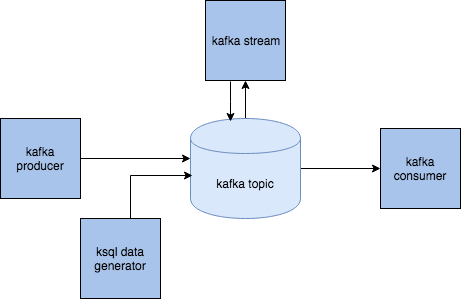

# kafka-stream-skeleton
<p>Kafka stream starter project</p>
<ul>
  <li><a href="#Overview">Overview</a></li>
  <li><a href="#Mock-data">Mock data</a></li>
  <li><a href="#Stream-processing">Stream processing</a></li>
  <li><a href="#Consuming-stream-data">Consuming stream data</a></li>
  <li><a href="#Installation">Installation</a></li>
</ul>

## Overview

This skeleton contains stream processor and consumer that just print out the stream output.
There is a module contains the data model used by the streaming application.
In order to fill the stream input topic with data, you can use data generation tool, or build the producer image.



## Mock data

1. By data generation
Confluent has great [tool](https://docs.confluent.io/current/ksql/docs/tutorials/generate-custom-test-data.html) to generate data by avro schema.

Check also [GitHub page](https://github.com/confluentinc/ksql/tree/master/ksql-examples)

The schema must be located in <root_directory>/schema.

The current schema is model.avro that has same types as the model used for stream processing.

The schema is used in docker-compose file, in image `datagen`

```yaml
  datagen:
    image: confluentinc/ksql-examples:latest
    container_name: datagen
    volumes:
    - ./schema:/schema
    command: "bash -c 'ksql-datagen \
                      schema=./schema/model.avro \
                      key=userName \
                          format=json \
                          topic=users-data \
                          maxInterval=1000 \
                          bootstrap-server=kafka:9092 \
                          propertiesFile=./schema/datagen.properties'"
```

If you wish to change the schema name, just change the value of the `schema` attribute, in the bash command section.

You may need also to change the key attribute and set it to one of the columns in your new schema.

The avro schema can be a very powerful tool, check more examples [here](https://github.com/confluentinc/ksql/tree/master/ksql-examples/src/main/resources)  
 
2. By custom producer

data can be also produced  by using KafkaProducer class. see the project module producer.

you need to specify the key and value serializations, there are defaults for primitives like String, int, long, byte array, for json we need to write our own class. 

```java
configProperties.put(ProducerConfig.KEY_SERIALIZER_CLASS_CONFIG, "org.apache.kafka.common.serialization.StringSerializer");
configProperties.put(ProducerConfig.VALUE_SERIALIZER_CLASS_CONFIG, "com.kafka_stream_skeleton.producer.serialization.JsonPOJOSerializer");
KafkaConsumer<String, Long> consumer = new KafkaConsumer<>(props);
```
If using this option, you need to uncomment producer image in the docker-compose file, and comment the datagen image

3. you can also run some kafka connect tool to some external source.
 
There is no example here. need to add your own docker image for it, or run it locally

## Stream processing

First, I recommend to check [confluent stream code example](https://github.com/confluentinc/kafka-streams-examples/tree/5.0.1-post/src/main/java/io/confluent/examples/streams).

Here in this project, Stream processing is done in the stream module's Application class. The stream reads the input topic data, and does some grouping and aggregation.
The stream must define SerDes (Serialization and Deserialization) for the key  and value. SerDes also need to be defined if grouping/counting/aggregation methods change the key/value type.

```java
Serde<LoginData> loginDataSerde = SerdeBuilder.buildSerde(LoginData.class);

final KStream<String, LoginData> source = builder.stream(INPUT_TOPIC, 
                                           Consumed.with(Serdes.String(), loginDataSerde));

```

and because the counting method change the types, SerDes must be specified in the `to` command:
```java

final Serde<String> stringSerde = Serdes.String();

Serde<LoginCount> loginCountSerde = SerdeBuilder.buildSerde(LoginCount.class);

counts.toStream().map((windowed,count)->new KeyValue<>(windowed.key(),new LoginCount(windowed.key(),count,windowed.window().start(),windowed.window().end())))
                .to(OUTPUT_TOPIC, Produced.with(stringSerde, loginCountSerde));
```

There are default SerDes for primitive types provided by Kafka Streams API. For JSON, one needs to write her own SerDes.
You can use the class`com.kafka_stream_skeleton.serialization.SerdeBuilder`, to create a JSON SerDes based on your model.

## Consuming stream data

Stream output data is written to an output topic. If you wish to consume and display the topic's content, there is a consumer example in this project, that just print result to the console.
Also here, one needs to specify correctly the deserializers, according to the stream results:

```java
props.put("key.deserializer", StringDeserializer.class.getName());
props.put("value.deserializer", "com.kafka_stream_skeleton.consumer.serialization.JsonPOJODeserializer");

KafkaConsumer<String, LoginCount> consumer = new KafkaConsumer<>(props);
    
consumer.subscribe(Arrays.asList(TOPIC));
```

to see output:
```
docker logs kafka-consumer -f
```

You can use Kafka Connect to send the results to an external system, such as SQL DB or elasticsearch.

## Installation

### prerequisite

1. docker
2. git
3. maven
4. jdk8 

### install 

If you wish to make changes to this repository, don't forget to fork this before cloning.

1. Run `mvn clean install`
2. You **MUST** add .env file contains **your IP**, for example:
```properties
LOCALHOST_IP=192.168.2.100
```
NOTE: if you change network, you may change this value according to your current IP.

3. `docker-compose up -d --build`

To make sure everything works well, run `docker ps`. You should see 4 containers running:

    1. kafka
    2. zookeeper
    3. kafka-stream
    4. kafka-consumer
    
4. To produce data into the input topic:

     4.1 Uncomment in `docker-compose.yml` file the service you want work with (datagen or producer)
     
     4.2 Run the container using `docker-compose up -d --build datagen` or `docker-compose up -d --build kafka-producer`
     
     4.3 If you wish to stop producing data, you can stop the containers using `docker-compose stop datagen` or `docker-compose stop producer`

5. Check if the consumer shows the stream output successfully:
  run `docker logs kafka-consumer -f` or `docker-compose logs -f consumer`.
  You should see output similar to this:

```
MESSAGE=> key:user_4, value:LoginCount{userName='user_4', count=1, windowStart=1545346143000, windowEnd=1545346144000}
MESSAGE=> key:user_2, value:LoginCount{userName='user_2', count=1, windowStart=1545346144000, windowEnd=1545346145000}
MESSAGE=> key:user_3, value:LoginCount{userName='user_3', count=1, windowStart=1545346144000, windowEnd=1545346145000}
MESSAGE=> key:user_4, value:LoginCount{userName='user_4', count=1, windowStart=1545346145000, windowEnd=1545346146000}
```  

### Run Stream from IDE

Before starting, make sure you stop **kafka-stream** docker container: `docker-compose stop stream`

In **kafka-stream** module, run the Application class.

This class expect 4 environment variable:

1. APPLICATION_ID
2. INPUT_TOPIC
3. OUTPUT_TOPIC
4. KAFKA_URL

docker-compose sets these values when running the container using docker. However, when running the application from IDE we need to set the values of those environment variables.
(For intelij, open run configuration, and set these variables in **Environment Variables** field)

By default, (unless you change topic names and ports), set this values

APPLICATION_ID="user-login-counts-app" 

INPUT_TOPIC="users-data" 

OUTPUT_TOPIC="user-login-counts" 

KAFKA_URL="0.0.0.0:9092"


